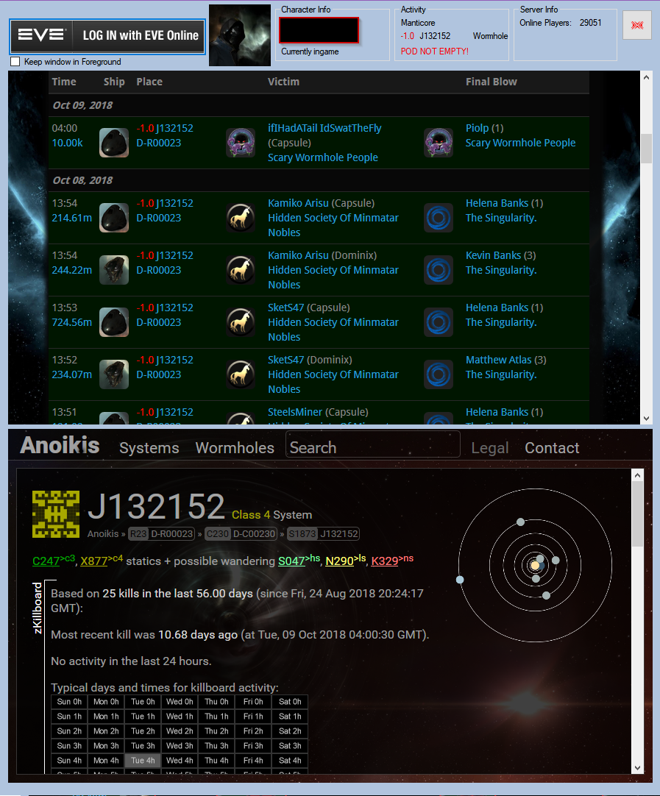

# Eve-FastIntel
Eve Online - Tool for gathering Intel in the current system of the logged on character  

After setting everything up you can run the tool, login and select the character.

# Requirements
It is recommended to use the setup-file (which does all the following stuff automatically for you).

If you want to compile it by yourself, follow these steps:
Compile the program and place all the DLLs from the firefox-engine into the same directory.

Then, set up an URI-Handler.  
If you want to do it manually, add these keys/values to the registry (adjust the path to the exe):

    HKEY_CLASSES_ROOT
       eveauth-fastintel
          DefaultIcon
             (Default) = "<pathtoyourapplication.exe,1"
          shell
             open
                command
                   (Default) = "<pathtoyourapplication.exe" "%1"
                   
Now you can run the program and use it.
